# Grafo Completo del Sistema Strands

## Arquitectura General

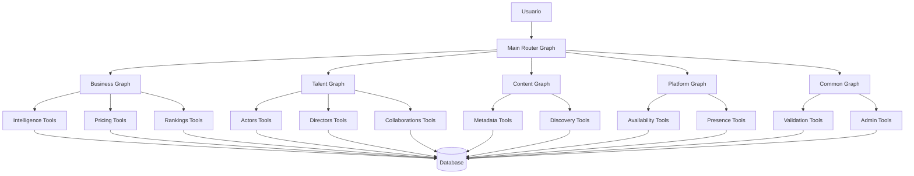

---

## Main Router Graph (11 Nodos)

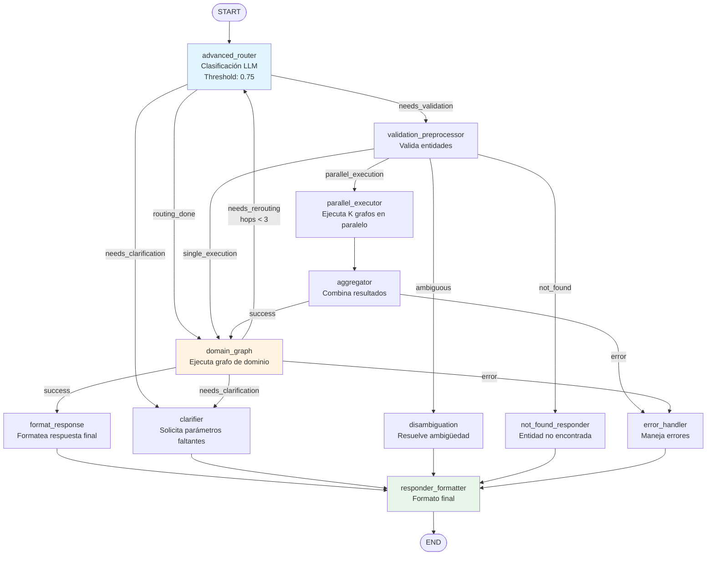

---

## Business Graph (6 Nodos)

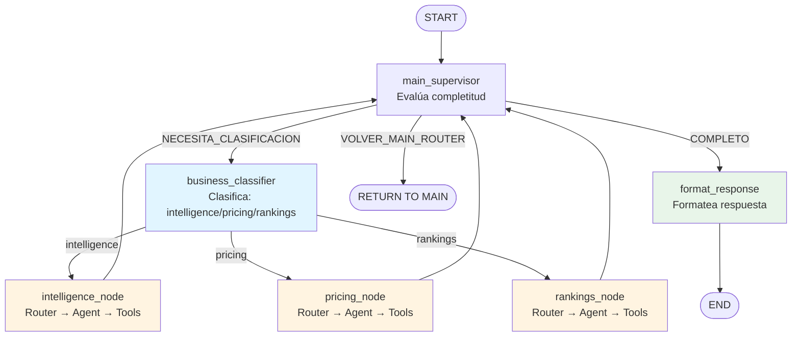

### Intelligence Node - Tools

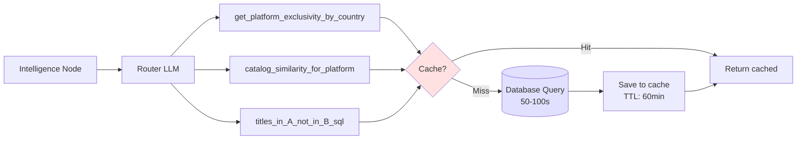

### Pricing Node - Tools

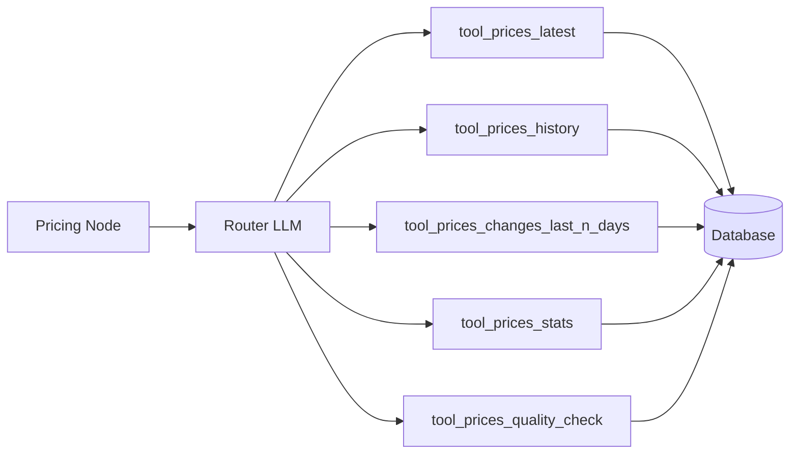

### Rankings Node - Tools

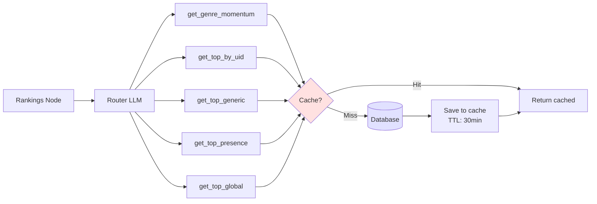

---

## Talent Graph (6 Nodos)

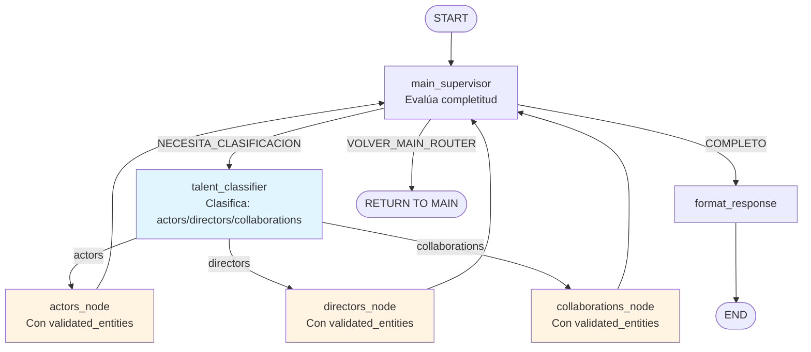

---

## Content Graph (5 Nodos)

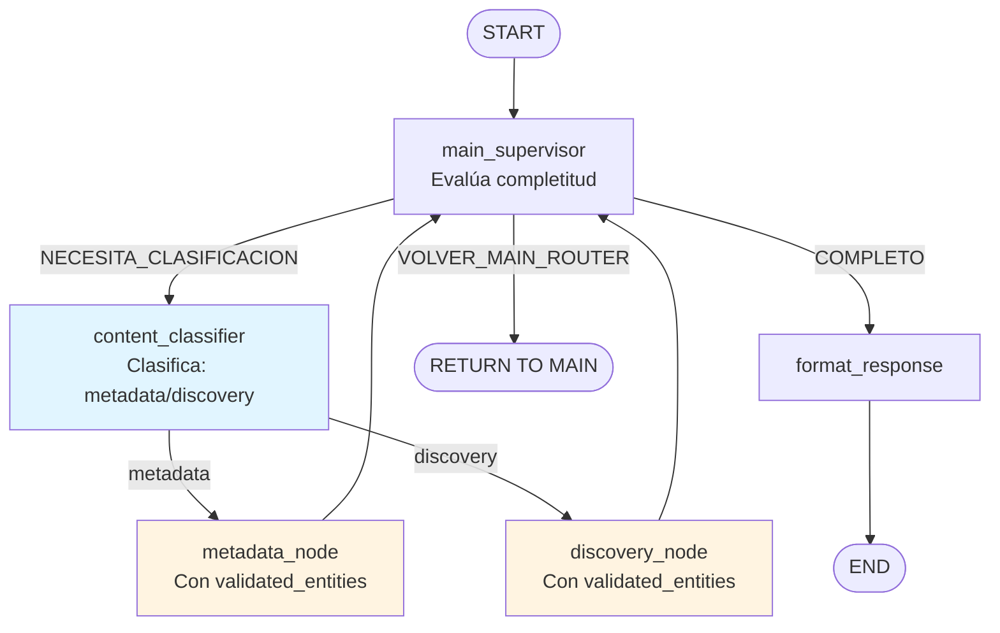

---

## Platform Graph (5 Nodos)

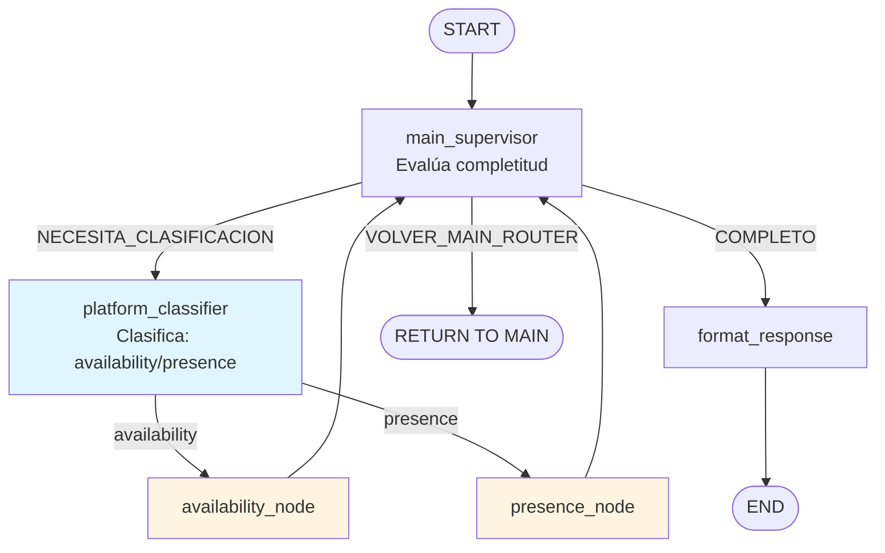

---

## Common Graph (5 Nodos)

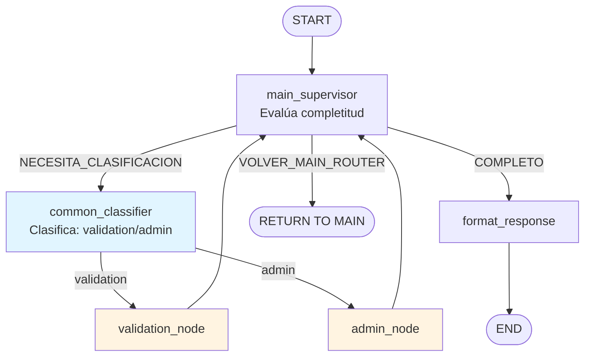

---

## Flujo de Ejecución Completo

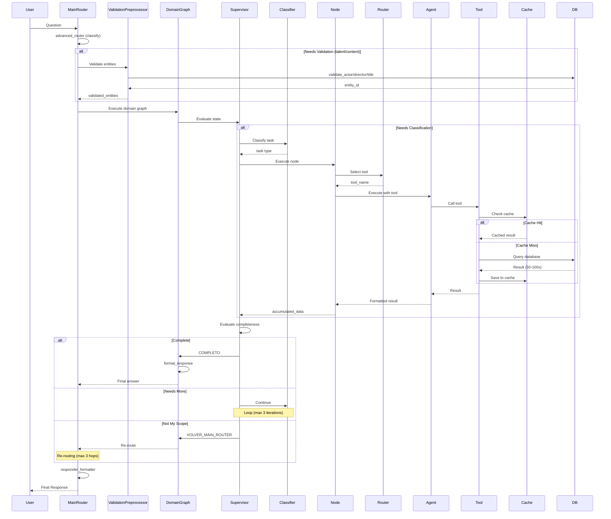

---

## Decisiones del Supervisor

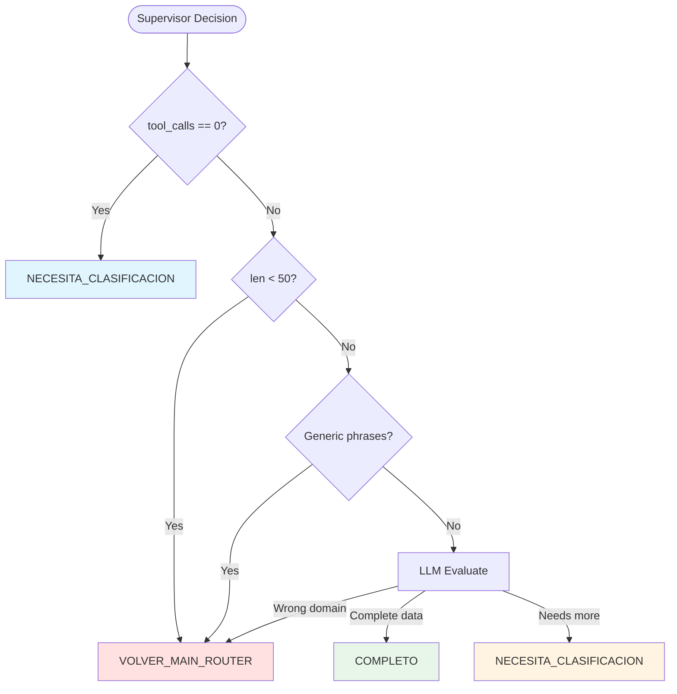

---

## Estrategia de Cache

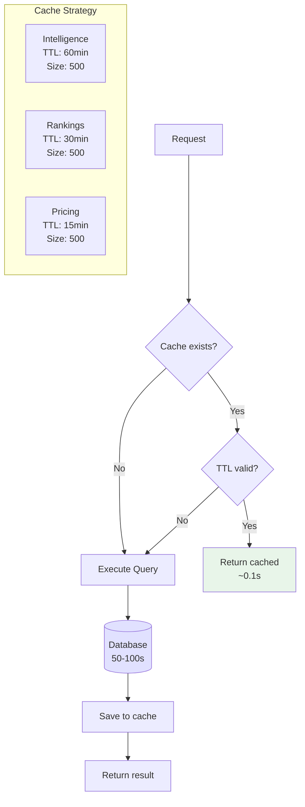

---

## Re-routing Logic

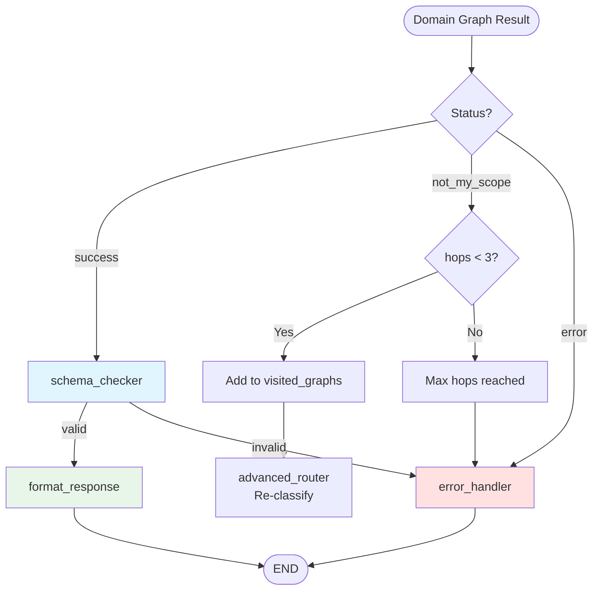

---

## Métricas de Performance

### Tiempos de Ejecución

| Componente | Cache Hit | Cache Miss | Promedio |
|------------|-----------|------------|----------|
| **Main Router** | - | - | 2-5s |
| **Validation** | - | - | 1-3s |
| **Domain Graph** | - | - | 1-2s |
| **Tool Execution** | <0.1s | 50-100s | 30-60s |
| **Format Response** | - | - | 1-2s |
| **TOTAL** | 10-15s | 60-110s | 40-70s |

### Hit Rate de Cache

- **Intelligence**: 40-60% hit rate
- **Rankings**: 30-50% hit rate
- **Pricing**: 20-40% hit rate

### Límites del Sistema

- **Max Hops**: 3 re-routings entre grafos
- **Max Iterations**: 3 iteraciones por domain graph
- **Max Parallel**: 3 grafos en paralelo
- **Confidence Threshold**: 0.75 para single execution

---

## Configuración de Dominios

### Confidence Thresholds

```python
DOMAIN_CONFIDENCE_THRESHOLDS = {
    "talent": 0.75,      # Alta precisión requerida
    "platform": 0.70,    # Precisión media-alta
    "business": 0.70,    # Precisión media-alta
    "content": 0.68,     # Precisión media
    "common": 0.50       # Fallback domain
}
```

### Grafos que Requieren Validación

```python
GRAPHS_REQUIRING_VALIDATION = ["talent", "content"]
```

### Grafos Seguros para Paralelización

```python
SAFE_PARALLEL_GRAPHS = {"talent", "content", "common"}
UNSAFE_PARALLEL_GRAPHS = {"business", "platform"}
```

---

## Estado del Sistema (State)

### MainRouterState

```typescript
{
    question: str
    answer: str
    selected_graph: "business" | "talent" | "content" | "platform" | "common"
    routing_confidence: float
    routing_candidates: List[(graph, score)]
    visited_graphs: List[str]
    validated_entities: Dict[str, Any]
    needs_validation: bool
    needs_clarification: bool
    needs_rerouting: bool
    parallel_execution: bool
    parallel_k: int
    rerouting_count: int
    max_hops: int
    tool_execution_times: Dict[str, float]
    telemetry_logger: TelemetryLogger
}
```

### Domain State (Business/Talent/Content/Platform/Common)

```typescript
{
    question: str
    answer: str
    task: str  // Tipo específico del dominio
    tool_calls_count: int
    max_iterations: int
    accumulated_data: str
    supervisor_decision: str
    needs_more: bool
    classification_done: bool
    status: "success" | "insufficient_data" | "format_error" | "max_iterations"
    last_node: str
    should_continue: bool
    tool_execution_times: Dict[str, float]
    validated_entities: Dict[str, Any]  // Solo talent/content
}
```

---

## Resumen de Componentes

### Total de Nodos

- **Main Router**: 11 nodos
- **Business**: 6 nodos (3 workers)
- **Talent**: 6 nodos (3 workers)
- **Content**: 5 nodos (2 workers)
- **Platform**: 5 nodos (2 workers)
- **Common**: 5 nodos (2 workers)
- **TOTAL**: 38 nodos

### Total de Tools

- **Intelligence**: 3 tools
- **Pricing**: 5 tools
- **Rankings**: 5 tools
- **Actors**: ~5 tools
- **Directors**: ~5 tools
- **Collaborations**: ~3 tools
- **Metadata**: ~5 tools
- **Discovery**: ~5 tools
- **Availability**: ~5 tools
- **Presence**: ~5 tools
- **Validation**: ~3 tools
- **Admin**: ~5 tools
- **TOTAL**: ~54 tools

### Factories Utilizados

1. **BaseExecutorNode**: Clase base para ejecutores de nodos
2. **create_router()**: Factory para routers LLM
3. **create_simple_classifier()**: Factory para classifiers
4. **QueryCache**: Sistema de caché con TTL

---

## Conclusión

El sistema Strands es una arquitectura de grafos multinivel que:

1. **Clasifica** preguntas en el Main Router
2. **Valida** entidades cuando es necesario (talent/content)
3. **Ejecuta** el grafo de dominio apropiado
4. **Supervisa** la completitud de la respuesta
5. **Re-enruta** si el dominio no es el correcto
6. **Cachea** resultados para optimizar performance
7. **Formatea** la respuesta final

Con soporte para:
- ✅ Ejecución paralela de múltiples grafos
- ✅ Re-routing inteligente entre dominios
- ✅ Validación de entidades
- ✅ Cache con TTL por dominio
- ✅ Tracking de tiempos de ejecución
- ✅ Telemetría completa
